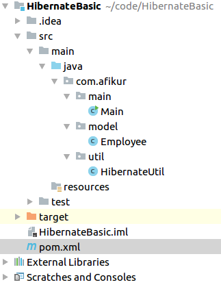

## Hibernate for Absolute Beginners
Hibernate is java based ORM (Object-relational mapping) tool that provides framework for mapping POJO (plain old java object) to the relational database tables and vice versa.



## Database Table Setup
```sql
CREATE TABLE `employees` (
  `id` int(11) unsigned NOT NULL AUTO_INCREMENT,
  `first_name` varchar(20) DEFAULT NULL,
  `last_name` varchar(20) DEFAULT NULL,
  `role` varchar(20) DEFAULT NULL,
  `created_at` datetime DEFAULT NULL,
  PRIMARY KEY (`id`)
) ENGINE=InnoDB AUTO_INCREMENT=1 DEFAULT CHARSET=utf8;
```
## Dependencies
```xml
<dependency>
    <groupId>org.hibernate</groupId>
    <artifactId>hibernate-core</artifactId>
    <version>5.2.16.Final</version>
</dependency>
<dependency>
    <groupId>mysql</groupId>
    <artifactId>mysql-connector-java</artifactId>
    <version>6.0.6</version>
</dependency>
```
<details>
	<summary>Click here to see entire pom.xml file</summary>
	
	<?xml version="1.0" encoding="UTF-8"?>
	<project xmlns="http://maven.apache.org/POM/4.0.0"
	         xmlns:xsi="http://www.w3.org/2001/XMLSchema-instance"
	         xsi:schemaLocation="http://maven.apache.org/POM/4.0.0 http://maven.apache.org/xsd/maven-4.0.0.xsd">
	    <modelVersion>4.0.0</modelVersion>

	    <groupId>com.afikur</groupId>
	    <artifactId>HibernateBasic</artifactId>
	    <version>1.0-SNAPSHOT</version>

	    <dependencies>
	        <dependency>
	            <groupId>org.hibernate</groupId>
	            <artifactId>hibernate-core</artifactId>
	            <version>5.2.16.Final</version>
	        </dependency>
	        <dependency>
	            <groupId>mysql</groupId>
	            <artifactId>mysql-connector-java</artifactId>
	            <version>6.0.6</version>
	        </dependency>
	    </dependencies>
	</project>
</details>

## SessionFactory Configuration

Create a java file `src/main/java/com.afikur.util/HibernateConfig.java`

```java
package com.afikur.util;

import com.afikur.model.Employee;
import org.hibernate.SessionFactory;
import org.hibernate.boot.registry.StandardServiceRegistryBuilder;
import org.hibernate.cfg.Configuration;
import org.hibernate.service.ServiceRegistry;

import java.util.Properties;

public class HibernateUtil {
    private static SessionFactory sessionJavaConfigFactory;

    private static SessionFactory buildSessionFactory() {
        try {
            Configuration configuration = new Configuration();

            Properties props = new Properties();
            props.put("hibernate.connection.driver_class", "com.mysql.jdbc.Driver");
			props.put("hibernate.dialect", "org.hibernate.dialect.MySQL5Dialect");
            props.put("hibernate.connection.url", "jdbc:mysql://localhost/testDB");
            props.put("hibernate.connection.username", "root");
            props.put("hibernate.connection.password", "password");
            props.put("hibernate.current_session_context_class", "thread");
            props.put("hibernate.id.new_generator_mappings", "false");
            props.put("hibernate.show_sql", "true");
            props.put("hibernate.hbm2ddl.auto", "none");

            configuration.setProperties(props);

            configuration.addAnnotatedClass(Employee.class);

            ServiceRegistry serviceRegistry = new StandardServiceRegistryBuilder().applySettings(configuration.getProperties()).build();

            return configuration.buildSessionFactory(serviceRegistry);
        }

        catch (Throwable ex) {
            System.err.println("Initial SessionFactory creation failed." + ex);
            throw new ExceptionInInitializerError(ex);
        }
    }

    public static SessionFactory getSessionFactory() {
        if(sessionJavaConfigFactory == null) sessionJavaConfigFactory = buildSessionFactory();
        return sessionJavaConfigFactory;
    }
}
```

## Create Model
Create a java file `src/main/java/com.afikur.model/Employee.java`

```java
package com.afikur.model;

import javax.persistence.*;
import java.util.Date;

@Entity
@Table(name="employees")
public class Employee {
    @Id
    @GeneratedValue(strategy = GenerationType.AUTO)
    @Column(name = "employee_id")
    private Long id;

    @Column(name = "first_name", length = 20, nullable = true)
    private String firstName;

    @Column(name = "last_name", length = 20, nullable = true)
    private String lastName;

    @Column(name = "role", length = 20, nullable = true)
    private String role;

    @Column(name = "created_at", nullable = true)
    private Date createdAt;


    public Long getId() {
        return id;
    }

    public void setId(Long id) {
        this.id = id;
    }

    public String getFirstName() {
        return firstName;
    }

    public void setFirstName(String firstName) {
        this.firstName = firstName;
    }

    public String getLastName() {
        return lastName;
    }

    public void setLastName(String lastName) {
        this.lastName = lastName;
    }

    public String getRole() {
        return role;
    }

    public void setRole(String role) {
        this.role = role;
    }

    public Date getCreatedAt() {
        return createdAt;
    }

    public void setCreatedAt(Date createdAt) {
        this.createdAt = createdAt;
    }
}
```

## Test Hibernate
Create a java file `src/main/java/com.afikur.main/Main.java`

```java
package com.afikur.main;

import com.afikur.model.Employee;
import com.afikur.util.HibernateUtil;
import org.hibernate.Session;
import org.hibernate.SessionFactory;

import java.util.Date;

public class Main {
   public static void main(String[] args) {
       Employee emp = new Employee();
       emp.setFirstName("Afikur Rahman");
       emp.setLastName("Khan");
       emp.setRole("Software Developer");
       emp.setCreatedAt(new Date());

       SessionFactory sessionFactory = HibernateUtil.getSessionFactory();
       Session session = sessionFactory.getCurrentSession();

       session.beginTransaction();
       session.save(emp);
       session.getTransaction().commit();

       sessionFactory.close();
   }
}
```
